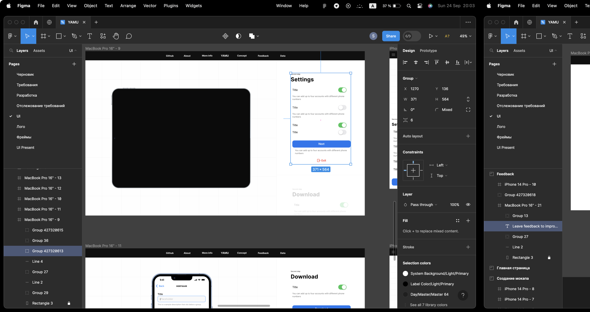
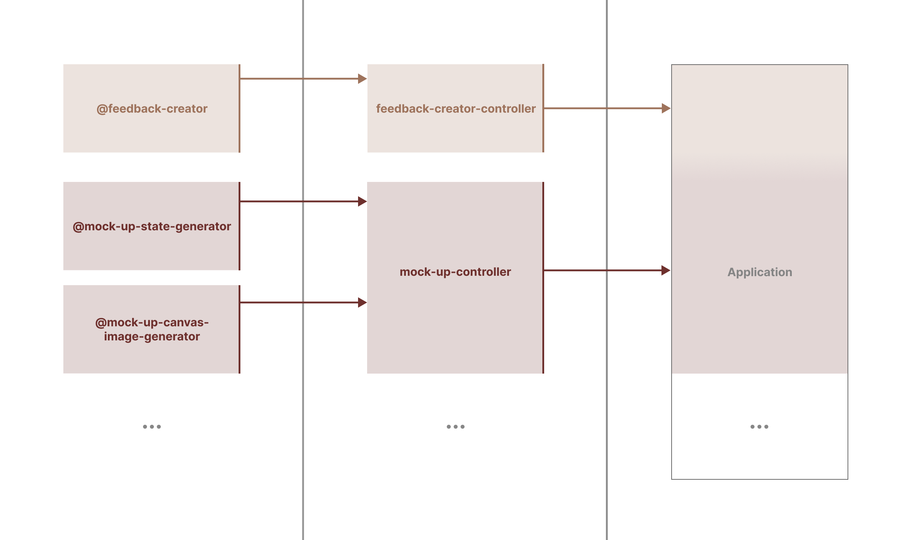
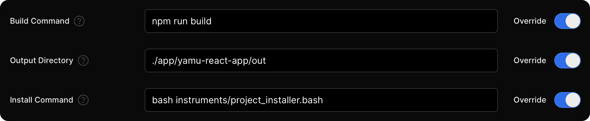

The application is designed for creating mock-ups. Create product mock-ups with the online mock-up generator. Simply select a mock-up, upload your design and download a watermark-free image.

https://yamu.vercel.app

<a href="https://github.com/hschhhwwwo0o/yamu/discussions">Recommendations, questions, opinions, feedback</a>

<br />
<br />
<br />
<br />

## Table of contents

- <a href="https://github.com/hschhhwwwo0o/yamu#development">Development</a>
  - <a href="https://github.com/hschhhwwwo0o/yamu#1-development-of-software-requirements">Development of software requirements</a>
  - <a href="https://github.com/hschhhwwwo0o/yamu#2-design-development">Design development</a>
  - <a href="https://github.com/hschhhwwwo0o/yamu#3-module-development">Module development</a>
  - <a href="https://github.com/hschhhwwwo0o/yamu#4-application-development">Application development</a>
  - <a href="https://github.com/hschhhwwwo0o/yamu#installation-and-start-dev-server">Installation and start dev server</a>
- <a href="https://github.com/hschhhwwwo0o/yamu#dictionary-of-terms">Dictionary of Terms</a>
- <a href="https://github.com/hschhhwwwo0o/yamu#software-requirements">Software requirements</a>
  - <a href="https://github.com/hschhhwwwo0o/yamu#quality-attributes">Quality Attributes</a>
  - <a href="https://github.com/hschhhwwwo0o/yamu#functional-requirements">Functional requirements</a>
  - <a href="https://github.com/hschhhwwwo0o/yamu#use-cases">Use cases</a>
- <a href="https://github.com/hschhhwwwo0o/yamu#deployment">Deployment</a>
- <a href="https://github.com/hschhhwwwo0o/yamu#remarks">Remarks</a>
- <a href="https://github.com/hschhhwwwo0o/yamu#literature">Literature</a>
- <a href="https://github.com/hschhhwwwo0o/yamu#useful-links">Useful links</a>

<br />
<br />
<br />
<br />

## Development.

Tracking of tasks was done using GitHub Projects.

The development of the project was divided into several stages:

1. Development of software requirements
2. Design development
3. Module development
4. Application development

### 1. Development of software requirements.

Before starting to develop the code base, the requirements to the software product were thought over. Functional and user requirements, quality attributes were formulated; a data dictionary and a dictionary of terms were compiled. Read more about the requirements for vital software in the chapter <a href="https://github.com/hschhhwwwo0o/yamu#software-requirements">«Software requirements»</a>

A unique identifier is created for each requirement. At the stage of code writing, the identifier of the implemented requirement is noted in the comment, which makes it easier to find the implementation of a particular requirement in the code base. For example:

```ts
/**
 * @requirement REQUIREMENT/ID
 */
async function sameName(): Promise<void> {
  ...
}
```

In the book «Software Requirements Engineering» by Carl Wiegers and Jay Beatty, this approach is called _requirement tracking_. To find anything related to a particular requirement use the codebase search (⇧⌘F in VSC on macOS) and enter the requirement ID. For example:


### 2. Design development.

The design of the application was developed in Figma/Photoshop. The design was developed in accordance with the previously developed software requirements.



### 3. Module development.

The application implements a «modular monolith» architecture. The project is separated into modules and application; modules are responsible for implementing the business logic; application is responsible for rendering the UI and executing the business logic through the modules. Thus, the application (in this case, the NextJS framework) is responsible only for displaying the UI, while the modules contain all the business logic. _Each module performs only one task and should not interact with other modules in any way_. Not all modules implement the subject area - general purpose modules are allowed.

The purpose of this separation is to separate business logic from fickle and windy frameworks and libraries that have nothing to do with business logic. The modules are designed in such a way that they can be used independently of the framework; this makes it very easy to migrate from ReactJS to VueJS, for example.

If you're using macOS or Linux (Doesn't work on Windows¹), you can use the tool to quickly create and configure a new module; run this command in the root of the project:

```sh
bash ./cli/module_creator.bash
```

At the moment there are 4 modules implemented in the project:

| Module name                     | Meaning of the module                                                                                             | Implements the subject area? |
| :------------------------------ | :---------------------------------------------------------------------------------------------------------------- | :--------------------------- |
| @mock-up-canvas-image-generator | The module is designed to generate an image based on the renderData object                                        | +                            |
| @mock-up-state-generator        | The module is intended for mock-up state management. Includes device selection, image insertion, device settings. | +                            |
| @feedback-creator               | The module is intended for sending feedback by the user.                                                          | +                            |
| @html-image-downloader          | The module is designed for downloading images.                                                                    | -                            |

<ins>Detailed descriptions of the modules and examples of their use are provided in the modules' documentation.</ins>

To change the logic of module operation and check the result of its work in the application, you need to recompile the module. This can be done using the build_modules script; execute this command in the root of the project:

```sh
npm run build-modules
```

If something went wrong, you can compile the modules yourself. To compile a module yourself, go to the module folder and execute the compile command:

```sh
npm run compile
```

### 4. Application development.

> _«When building interactive applications, as with other programs, modularity of components has enormous benefits. Isolating functional units from each other as much as possible makes it easier for the application designer to understand and modify each particular unit, without having to know everything about the other units._
>
> _Model-View-Controller metaphor and its application structuring paradigm for thinking about (and implementing) interactive application components was developed. Models are those components of the system application that actually do the work (simulation of the application domain). They are kept quite distinct from views, which display aspects of the models. Controllers are used to send messages to the model, and provide the interface between the model with its associated views»_
>
> <ins>«A Description of the Model-View-Controller User Interface Paradigm in the Smalltalk-80 System» Glenn E. Krasner and Stephen T. Pope</ins>

An architecture is developed where modules play the role of MVC models. Controllers use module methods; one controller can be linked to several modules; controller serves as a link between modules and view; controllers are not linked to the framework and are just classes, so they can be reused with any other framework to render the view. View calls controller methods and knows nothing about business logic.

The structure of the project is a modular monolith.



> _«The modular monolith is a variation as a subset of the single-process monolith: a single process consists of separate modules, each of which can be worked on independently, but all of which must still be combined»_
>
> <ins>«From monoliths to microservices» by Sam Newman</ins>

<ins>You can read more about this paragraph here /app/yamu-react-app/README.md</ins>

<br />

### Installation and start dev server.

To install the repository, paste this command into your terminal:

```sh
git clone https://github.com/hschhhwwwo0o/yamu.git
```

If you are a macOS or Linux user, (Doesn't work on Windows¹) the project installation is done in 1 line of code in the terminal; to install application and module dependencies, copy this command and run it in the project root:

```sh
bash cli/project_installer.bash
```

_If the install script gives an error (Doesn't work on Windows¹), you must install the module dependencies yourself, compile the modules, install the application dependencies, and install husky to install it._

Start the dev server using the command in the root of the project:

```sh
npm run dev
```

<br />
<br />
<br />
<br />

## Dictionary of Terms.

> _«A dictionary of terms defines all the specialized terms that the reader needs to know in order to properly understand the software requirements specification»_
>
> <ins>«Development of software requirements», Third Edition. Carl Vigers, Jay Beatty</ins>

The term dictionary is intended to ensure that the same terms are used throughout the code base. For example, to eliminate the use of synonym words.

| Term                    | Meaning                                                                                                               |
| :---------------------- | :-------------------------------------------------------------------------------------------------------------------- |
| Export                  | The process of saving a layout to a file or to another format that can be used in further development or use.         |
| Devices library         | A collection of devices available for creating mockups.                                                               |
| Mock-up settings wizard | Mockup settings panel consisting of several steps.                                                                    |
| Mock-up preview         | Mockup display.                                                                                                       |
| Mock-up preview scene   | The scene in which the mockup is displayed.                                                                           |
| Selected device         | The device selected for the mockup.                                                                                   |
| System bar              | The system panel, usually located on top and displaying network data, time, and so on.                                |
| Inserted design         | An image of the application design intended to be inserted into the layout.                                           |
| Frame                   | Imitation of the device case. Within the framework of the tool, the frame is used as an application design container. |
| Device type             | Watch, Phone, Tablet.                                                                                                 |
| Device                  | Real device; phone/tablet. With a refined model.                                                                      |
| Mock-up                 | An application design placed inside a frame and displaying how the application design will look on real devices.      |
| HIG                     | A set of guidelines for designers.                                                                                    |
| WCAG                    | A set of guidelines on how to create an interface and how to check its accessibility for users with disabilities.     |
| Open Graph              | Micro markup for SEO.                                                                                                 |
| Lighthouse              | Automated tool for measuring the quality of web pages.                                                                |

<br />
<br />
<br />
<br />

## Software requirements.

> _«Requirements are a specification of what needs to be implemented. They describe the behavior of the system, the properties of the system or its attributes. They can serve as constraints in the system development process.»_
>
> <ins>Ian Sommerville, Pete Sawyer, 1997</ins>

### Quality Attributes.

> _«Quality attributes describe the characteristics observed during software execution. They strongly influence the perception of the system by users and the opinion that users have about its quality.»_
>
> <ins>«Development of software requirements», Third Edition. Carl Vigers, Jay Beatty</ins>

| Attribute                                  | ID                       | Description / Why it's necessary                                                | Done |
| :----------------------------------------- | :----------------------- | :------------------------------------------------------------------------------ | :--: |
| Separation of the mock-up creation process | QA/MOCK-UP/CREATE-STEPS  | Separation the process into steps is necessary for a better UX                  |  ✅  |
| UI is based on HIG                         | QA/UI/HIG                | HIG is essential for a better UX                                                |  ✅  |
| Localization                               | QA/LOCALIZATION          | Localization is necessary because the product can be used by foreign users      |  ❌  |
| Interface adaptation                       | QA/UX/ADAPTIVE-INTERFACE | An adapative interface is needed to better display the app on different devices |  ✅  |
| WCAG compliance                            | QA/UX/WCAG               | WCAG is needed for a better UX for people with disabilities                     |  ✅  |
| Error output                               | QA/UX/ERRORS-LOG         | Necessary for a better UX                                                       |  ❌  |
| High Lighthouse testing results            | QA/SEO/LIGHTHOUSE        | Necessary to improve search engine rankings                                     |  ✅  |
| Open Graph support                         | QA/SEO/OPEN-GRAPH        | Necessary to improve search engine rankings                                     |  ❌  |
| Description of standard meta tags          | QA/SEO/META              | Necessary to improve search engine rankings                                     |  ✅  |

### Functional requirements.

> _«Functional requirements can be written in terms of what the system does or what the user does.»_
>
> <ins>«Development of software requirements», Third Edition. Carl Vigers, Jay Beatty</ins>

| Functional requirement                   | ID                                 | Responsible element             | Done |
| :--------------------------------------- | :--------------------------------- | :------------------------------ | :--: |
| Sending feedback                         | UF/FEEDBACK/CREATE                 | @feedback-creator               |  ✅  |
| Downloading a mock-up                    | UF/MOCK-UP/DOWNLOAD                | @html-image-downloader          |  ✅  |
| Mock-up image generate                   | UF/MOCK-UP/IMAGE-GENERATE          | @mock-up-canvas-image-generator |  ✅  |
| Render mock-up                           | UF/MOCK-UP/RENDER                  | @app                            |  ✅  |
| Getting affordable devices               | UF/DEVICES-LIBRARY/GET             | @mock-up-state-generator        |  ✅  |
| Choosing a device                        | UF/MOCK-UP/DEVICE-SELECT           | @mock-up-state-generator        |  ✅  |
| Adding an design inside a mock-up        | UF/MOCK-UP/INSERT-DESIGN           | @mock-up-state-generator        |  ✅  |
| Reset the mock-up                        | UF/MOCK-UP/CLEAR                   | @mock-up-state-generator        |  ✅  |
| Mock-up initialization                   | UF/MOCK-UP/INIT                    | @mock-up-state-generator        |  ✅  |
| <br /> Setting up a mock-up              | <br /> UF/MOCK-UP/SETTINGS-UP      | @mock-up-state-generator        |  ✅  |
| Getting available settings               | UF/DEVICE/GET-SETTINGS             | @mock-up-state-generator        |  ✅  |
| Switching the device's system bar        | UF/DEVICE/OPTION-SYSTEM-BAR-TOGGLE | @mock-up-state-generator        |  ✅  |
| Switching the theme of the device system | UF/DEVICE/OPTION-THEME-TOGGLE      | @mock-up-state-generator        |  ✅  |
| BW color correction mock-up              | UF/MOCK-UP/OPTION-BW-STYLE         | @mock-up-state-generator        |  ✅  |

### Use cases.

> _«A use case describes how to use an automated system. It determines what the user should enter, what should be output in response, and what actions should be performed to obtain the output information.»_
>
> <ins>«Development of software requirements», Third Edition. Carl Vigers, Jay Beatty</ins>

| ID                | UC/CREATE-MOCK-UP                                                                                                      |
| :---------------- | :--------------------------------------------------------------------------------------------------------------------- |
| Acting person     | User                                                                                                                   |
| Description       | The user selects the device for which he would like to make a mock-up. Configures the mock-up with subsequent download |
| Output conditions | **UC/CREATE-MOCK-UP/POST-1.** The system asks for feedback                                                             |

| ID            | UC/CREATE-MOCK-UP/POST-1                                                                |
| :------------ | :-------------------------------------------------------------------------------------- |
| Acting person | User                                                                                    |
| Description   | The user enters their feedback in the text box and submits it by clicking on the button |

<br />
<br />
<br />
<br />

## Deployment.

Deployment requires:

1. Install all dependencies

```sh
bash cli/project_installer.bash
```

2. Compile the application

```sh
npm run build
```

3. Run infinite loop / specify out folder

To implement with the start of an endless loop, execute the command:

```sh
npm run start
```

To implement by specifying the output folder, specify the path: `./app/yamu-react-app/out`.

Exaple on Vercel:



<br />
<br />
<br />
<br />

## Remarks.

¹ If you are a Windows user, you can probably use WSL to work with unix commands.

## Literature.

The development process was strongly influenced by the books:

- «Development of software requirements» Carl Vigers, Jay Beatty;
- «Clean Architecture» Robert Martin;
- «Envisioning Information» Edward R. Tufte;
- «A Description of the Model-View-Controller User Interface Paradigm in the Smalltalk-80 System» Glenn E. Krasner and Stephen T. Pope;
- «From monoliths to microservices» Sam Newman

## Useful links.

- <a href="https://nextjs.org/docs/app/building-your-application/deploying/static-exports">Static export deployment on Vercel</a>
- <a href="https://nextjs.org/docs/pages/building-your-application/deploying#nextjs-build-api">Build app on Vercel</a>
